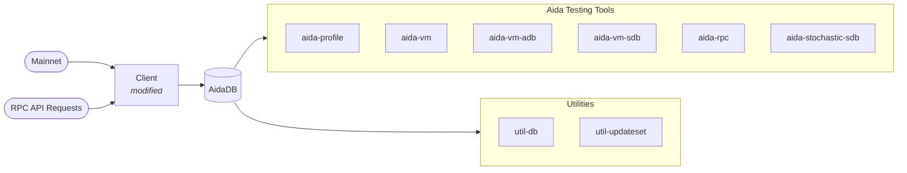

# Aida

Aida is a testing infrastructure for Sonic Labs' blockchain (formerly Fantom).

## Overview

The main purpose of Aida is to provide a testing fixture for new block-processing components such as
StateDB databases and virtual machines. A StateDB database contains balances, nonce, code, and
storage key-value pairs of accounts; a virtual machine can process smart contracts. In general, the
block-processing of a blockchain evolves the state from one block/transaction to the next. This
state transition is highly complex, and the idea of Aida is to provide testing tools so that it can
be selected to test StateDB databases and virtual machines in isolation. Making the StateDB/Virtual
Machine the System Under Test (SUT) permits wider coverage and more targeted tests rather than
performing integration tests/systems tests with the client, which contains block processing.

The testing is performed with various tools and data sets. At the centre is the
[AidaDB](Terminology.md#aidadb), which stores recorded substates — the minimal slice of world-state
needed to execute each transaction in isolation (involved accounts, storage key/value pairs, contract
code, etc.). The substate concept originates from
[research at Yonsei University](https://www.usenix.org/conference/atc21/presentation/kim-yeonsoo).
A modified client records these substates as a side-effect of processing blocks from the network.

Substate-based tools from Yonsei University can verify individual transactions, but they don't test
whether the **full world-state stays consistent** across millions of blocks. For that, tools like
`aida-vm-adb` replay transactions against a real StateDB and validate the cumulative state.

Aida's tooling falls into three categories:

- **Recorders** — modified clients that capture test data (substates, state hashes)
  into the AidaDB during block processing.
- **Generators** — utilities that produce additional data for the AidaDB (update-sets, merged
  databases).
- **Replayers** — tools that replay recorded data against a StateDB or VM in isolation, enabling
  targeted testing without a full node.

List of tools performing tests and obtaining metrics:
 - [`aida-vm-sdb`](commands/aida-vm-sdb.md) **Block Processing Manager** — Orchestrates
   block/transaction execution with substates, Ethereum tests, and tx generation.
 - [`aida-vm`](commands/aida-vm.md) **EVM Evaluation Tool** — Tests world-state evolution of a VM
   and its StateDB.
 - [`aida-vm-adb`](commands/aida-vm-adb.md) **Archive Evaluation Tool** — Runs transactions on
   historic states derived from an archive DB.
 - [`aida-rpc`](commands/aida-rpc.md) **RPC Replay** — Tests RPC interface correctness by replaying
   recorded requests.
 - [`aida-stochastic-sdb`](commands/aida-stochastic-sdb.md) **Stochastic-Test Manager** — Generates,
   records, and replays stochastic tests.
 - [`aida-profile`](commands/aida-profile.md) **Storage Profile Manager** — Profiles the
   world-state.

List of generator/utility tools:
 - [`util-db`](commands/util-db.md) A tool for managing Aida databases (cloning, merging,
   compacting, validating).
 - [`util-updateset`](commands/util-updateset.md) A tool for generating the update sets for priming
   the world state at any arbitrary height.

## Documentation

### Architecture

- [Architecture Overview](architecture/README.md) — pipeline design, parallelism modes, data flow
- [Providers](architecture/Providers.md) — data sources feeding the executor pipeline (Substate,
  EthTest, RPC, Norma)
- [Processors](architecture/Processors.md) — transaction execution engines (Live, Archive, EthTest,
  Tosca)
- [Extension System](architecture/extensions/README.md) — lifecycle hooks for StateDB management,
  validation, profiling, and more

### Commands

- See the [`commands/`](commands/) directory for individual command documentation.
