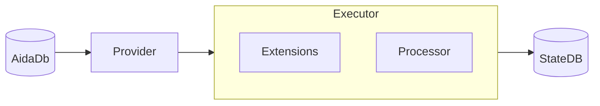

# Architecture Overview

Aida's core execution engine follows a **Decorator Pipeline** pattern. Three components work
together to process blockchain transactions in isolation:

```
Provider ──▶ Executor ──▶ Processor
                │
            Extensions
         (hooks around each step)
```

## Components

| Component | Role |
|-----------|------|
| [**Provider**](Providers.md) | Supplies transaction data (substates, RPC recordings, Ethereum tests, or synthetic txs) |
| [**Processor**](Processors.md) | Executes transactions against a StateDB using an EVM backend (go-ethereum or [Tosca](../Terminology.md#tosca)) |
| [**Extension**](extensions/README.md) | Decorates execution with lifecycle hooks — manages StateDB, validates results, profiles performance, logs progress |

## Execution Pipeline

The Executor orchestrates the flow:

```
PreRun()
  for each block:
    PreBlock()
      for each transaction:
        PreTransaction()
        Processor.Process(transaction)
        PostTransaction()
    PostBlock()
PostRun()
```

- **Pre** hooks fire in registration order (forward)
- **Post** hooks fire in reverse order (backward) — ensuring symmetric setup/teardown
- Extensions can modify the shared `Context` (StateDB, Archive, results)

## Parallelism

| Mode | Block Hooks | Transaction Hooks | Use Case |
|------|-------------|-------------------|----------|
| Sequential (1 worker) | ✅ | ✅ | `aida-vm-sdb` — deterministic replay |
| Parallel by block (N workers) | ✅ per worker | ✅ per worker | `aida-vm-adb` — archive validation |
| Parallel by transaction (N workers) | ❌ | ✅ per worker | `aida-vm` — throughput testing |

## Data Flow



## Extension Categories

| Category | Count | Purpose |
|----------|-------|---------|
| [StateDB](extensions/statedb.md) | 16 | DB lifecycle, block/tx events, state preparation |
| [Validator](extensions/validator.md) | 10 | Correctness checking (hashes, state diffs, RPC responses) |
| [Profiler](extensions/profiler.md) | 8 | CPU, memory, gas, operation profiling |
| [Logger](extensions/logger.md) | 5 | Progress, error, and debug logging |
| [Tracker](extensions/tracker.md) | 3 | Progress tracking to console |
| [Primer](extensions/primer.md) | 3 | State initialization and fast-forward |
| [Register](extensions/register.md) | 2 | Progress reporting via filesystem IPC |
