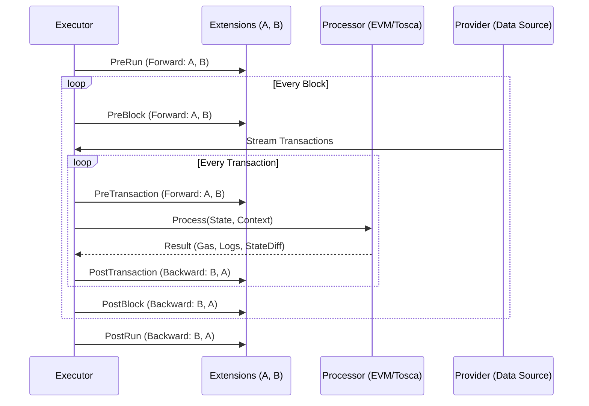

# Extension System

Extensions add behavior around transaction processing via lifecycle hooks. They handle everything
from StateDB management to validation, profiling, and logging.

## Extension Interface

Every extension implements 6 hooks:

```go
type Extension[T any] interface {
    PreRun(State[T], *Context) error
    PostRun(State[T], *Context) error
    PreBlock(State[T], *Context) error
    PostBlock(State[T], *Context) error
    PreTransaction(State[T], *Context) error
    PostTransaction(State[T], *Context) error
}
```

**`NilExtension[T]`** (defined in `executor/extension/nil_extension.go`) provides a base
implementation where all hooks return `nil`. Extensions embed `NilExtension` and override only the
hooks they need. When creating a new extension, embedding `NilExtension` is the recommended starting
point.

## Execution Order

**Pre(scope)** hooks fire in **forward** order (first registered → first called).
**Post(scope)** hooks fire in **reverse** order (last registered → first called).

This **symmetry rule** ensures proper setup/teardown — e.g., the StateDB is opened first in PreRun
and closed last in PostRun. A typical extension chain might register: StateDbManager → Primer →
Processor → Validator. In Pre hooks they fire in that order; in Post hooks they fire in reverse
(Validator → Processor → Primer → StateDbManager), guaranteeing each extension cleans up in the
opposite order it was initialized.

## Execution Flow



## State and Context

| Type | Contents | Mutability |
|------|----------|------------|
| `State[T]` | Block number, Transaction index, Data (`T`) | Immutable input |
| `Context` | State (DB), Archive, StateDbPath, AidaDb, ErrorInput channel, ExecutionResult | Mutable shared state |

## Execution Modes

| Mode | Workers | Hooks Available | Context |
|------|---------|-----------------|---------|
| Sequential | 1 | All 6 hooks | Shared |
| Parallel (TransactionLevel) | N | PreRun/PostRun + PreTransaction/PostTransaction | Per-worker |
| Parallel (BlockLevel) | N | All 6 hooks | Per-worker |

In parallel modes, PreRun/PostRun are called once globally, while per-block/per-transaction hooks
run within each worker's context.

## Extension Categories

| Category | Count | Description |
|----------|-------|-------------|
| [StateDB](statedb.md) | 16 | DB lifecycle, event emission, state preparation |
| [Validator](validator.md) | 10 | Output validation and correctness checking |
| [Profiler](profiler.md) | 8 | CPU/memory profiling, diagnostics, gas tracking |
| [Logger](logger.md) | 5 | Progress, error, and debug logging |
| [Tracker](tracker.md) | 3 | Progress tracking and reporting |
| [Primer](primer.md) | 3 | State priming and initialization |
| [Register](register.md) | 2 | External progress monitoring |

## Creating an Extension

```go
package myextension

import (
    "github.com/0xsoniclabs/aida/executor"
    "github.com/0xsoniclabs/aida/executor/extension"
)

type MyValidator[T any] struct {
    extension.NilExtension[T]
}

func (m *MyValidator[T]) PostTransaction(state executor.State[T], ctx *executor.Context) error {
    gas := ctx.ExecutionResult.GetGasUsed()
    if gas > 1_000_000 {
        // handle high gas usage
    }
    return nil
}
```

## Parallel Safety

When running in parallel, the `Context` is **shallow-copied** per worker. Shared resources (maps,
file handles) must be protected with mutexes or atomic operations. `PreRun`/`PostRun` are always
single-threaded.
